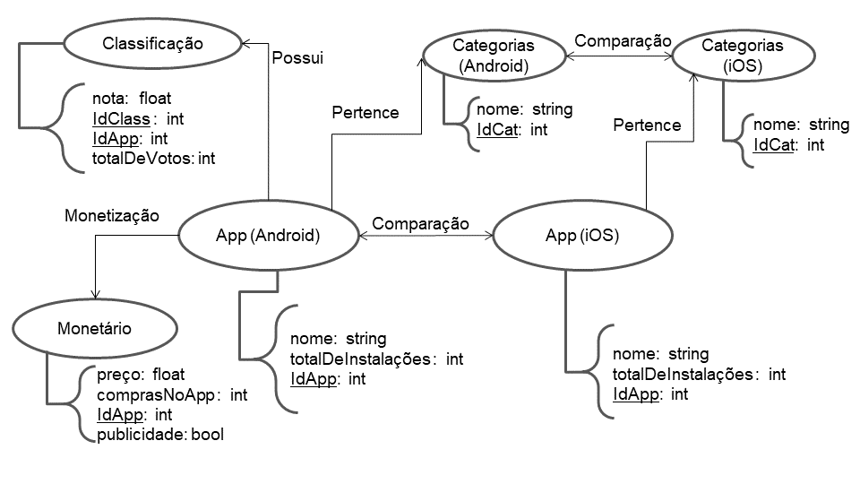

# Aluno
* `214752`: `Daniel Mendes dos Santos`
## Modelo Lógico do Banco de Dados de Grafos
> 

## Perguntas de Pesquisa/análise

> Liste aqui as três perguntas de pesquisa/análise
> * Qual é a porcentagem média da quantidade de avaliações pela quantidade instalações do Android e Ios? 
> * Qual é a diferença no número de instalações para cada categoria entre aplicativos monetizados e não monetizados?
> * Aplicativos que são pagos de uma mesma categoria tendem a ter receber avaliações melhores ou piores do que os não monetizados?

