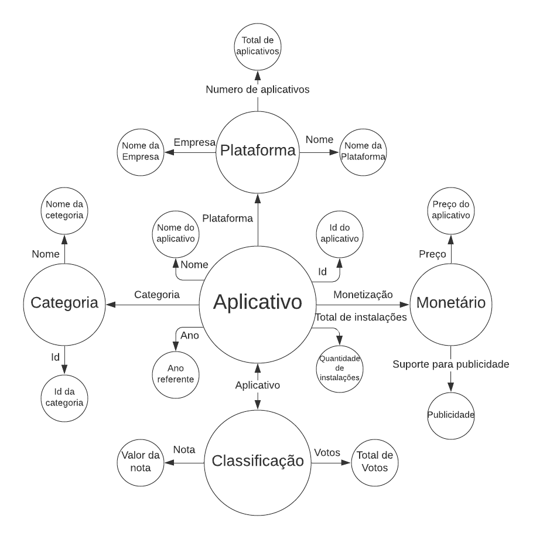

# Aluno
* 214752: Daniel Mendes dos Santos
## Grafo de conhecimento
> 

## Perguntas de Pesquisa/Análise

> * Em quai anos tiveram a maior quantidade de dowloads de uma mesma categoria?
> *Aplicativos de uma mesma categoria, são prejudicado no número de downloads se tiverem suporte para publicidade? Qual é a curva de dowloads para cada categoria monetizado e não monetizado? 
> * Qual é a influência da plataforma na classificação do aplicativo? Qual sua a relação entre o número de avaliações e a quantidade de instalações para cada plataforma?

